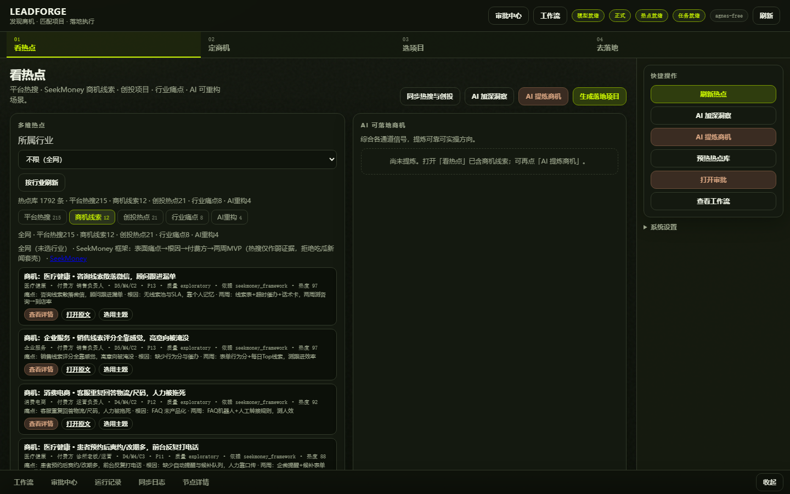
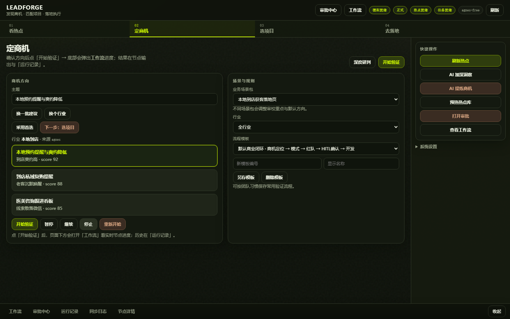
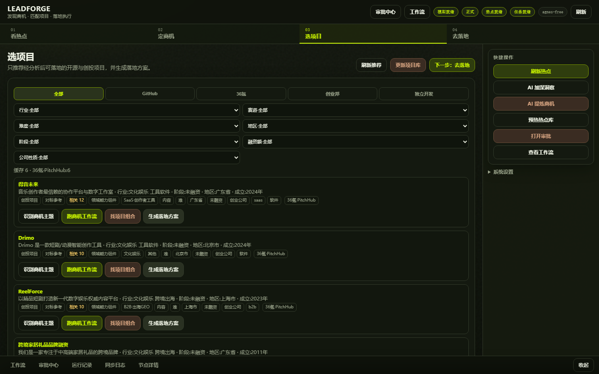
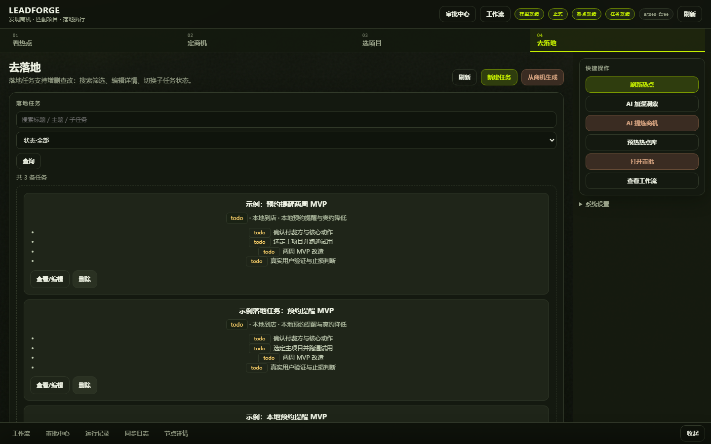
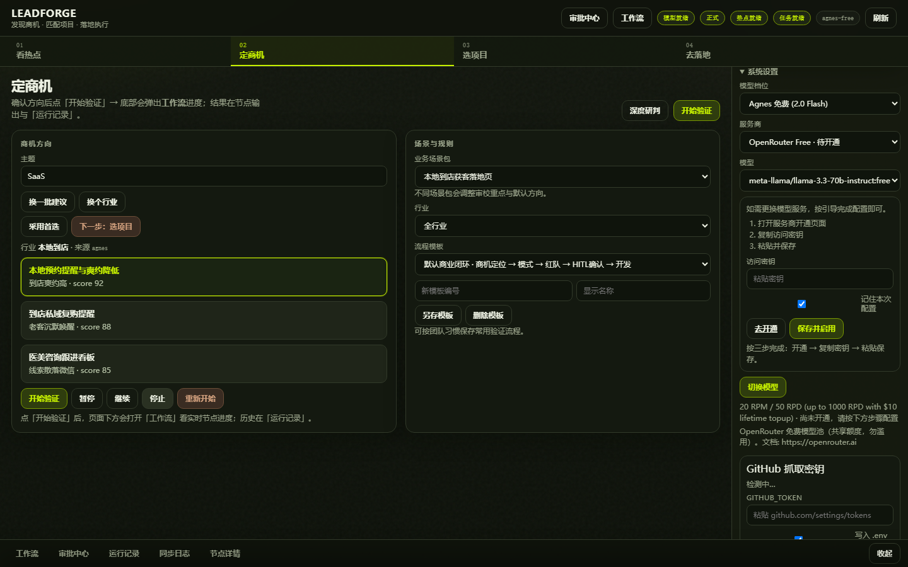

# LeadForge

[](./LICENSE)
[](https://github.com/taomylife521/AI-LeadForge)
[](https://ai-leadforge.vercel.app)

**发现商机 · 匹配项目 · 落地执行**

LeadForge 是面向独立开发者与一人公司（OPC）的开源商业智能体工作台：从全网热点与创投信号中提炼**可验证商机**，匹配可落地开源/创投项目，并用工作流 + HITL 门禁推进到任务拆解。

> 作者 / 版权：**taomylife521 (Soul Coders)** · MIT 开源（需保留署名与许可证声明）  
> 仓库：https://github.com/taomylife521/AI-LeadForge  
> 线上（海外可访）：https://ai-leadforge.vercel.app  
> 工程规范：[`AGENTS.md`](./AGENTS.md) · 部署同步：[`docs/06-deploy-and-sync.md`](./docs/06-deploy-and-sync.md)

---

## 目录

1. [界面预览](#界面预览)
2. [30 秒搞懂怎么用](#30-秒搞懂怎么用)
3. [完整使用指南（四步流水线）](#完整使用指南四步流水线)
4. [一键部署](#一键部署)
5. [更换模型（详细）](#更换模型详细)
6. [环境变量速查](#环境变量速查)
7. [项目介绍与技术栈](#项目介绍与技术栈)
8. [文档 / 致谢 / 协议](#文档--致谢--协议)

---

## 界面预览

### 01 看热点

多维通道：平台热搜 · SeekMoney 商机线索 · 创投 · 行业痛点 · AI 重构（一痛点一条，含为何此项目 / 组合更优 / 成功概率，可点开原文）。



### 02 定商机

确认主题与行业，选择场景包与流程模板，点「开始验证」跑商机工作流；底部「工作流 / 运行记录」看节点进度。



### 03 选项目

只推荐经分析后可落地的开源 / 创投项目；卡片上可「跑商机工作流」「生成落地方案」。



### 04 去落地

本地落地任务增删查改，子任务状态跟踪（也可从商机一键生成）。



### 05 系统设置 · 换模型

右侧「系统设置」：切换模型档位 / 免费目录服务商 / 粘贴密钥 / GitHub Token / 定时同步。



---

## 30 秒搞懂怎么用

| 步骤 | 你做什么 | 成功标志 |
|:---|:---|:---|
| 1 | 双击 `start-local.bat`，浏览器打开 http://127.0.0.1:8080 | 顶栏「模型就绪」「热点就绪」亮起 |
| 2 | 在 **01 看热点** 点「同步热搜与创投」或「预热热点库」 | 通道数字 > 0，卡片有「选用主题」 |
| 3 | 点某张卡的「选用主题」，或进入 **02 定商机** 填主题后点「开始验证」 | 底部弹出工作流节点推进 |
| 4 | **03 选项目** →「刷新推荐」；满意后 **04 去落地** 建任务 | 有项目卡片 / 任务列表 |

默认模型档位：`agnes-free`（需在 `.env` 填 `AGNES_API_KEY`）。顶栏会显示当前档位名（如 `agnes-free`）。

---

## 完整使用指南（四步流水线）

### 准备工作（首次必做）

1. **复制环境文件**

```powershell
cd E:\ND.APP\agent\AIAgent\leadforge   # 换成你的仓库路径
copy .env.example .env
```

2. **至少填一个模型 Key**（推荐 Agnes 免费）

打开 `.env`，填写：

```env
AGNES_API_KEY=你的密钥
AGNES_API_BASE=https://apihub.agnes-ai.com
MODEL_PROFILE=agnes-free
MOCK_LLM=false
```

可选但强烈建议：

```env
GITHUB_TOKEN=ghp_xxxx          # 提高 GitHub Search 限额，避免 403
BOCHA_API_KEY=...              # 或 SERPER_API_KEY，本土商机检索更稳
```

3. **启动**

```powershell
双击 start-local.bat
# 或：apps\api\.venv\Scripts\python -m uvicorn app.main:app --host 0.0.0.0 --port 8080
```

4. **健康检查**

浏览器打开 http://127.0.0.1:8080/api/health  
期望类似：`{"ok":true,"profile":"agnes-free","has_llm_key":true}`

---

### 步骤 01 — 看热点

**目标**：从热搜 / 商机线索 / 创投 / 痛点里挑一个值得做的方向。

1. 顶部流水线点 **01 看热点**（默认页）。
2. 「所属行业」可选「不限」或具体行业，再点「按行业刷新」。
3. 推荐操作顺序：
   - **预热热点库**（右侧快捷操作）：把公开源写入本地库，首次较慢。
   - **同步热搜与创投**：增量拉 newsnow / 36氪 / 创业邦等。
   - 切到 **商机线索（SeekMoney）** 页签：看「表面痛点 → 根因 → 付费方」结构卡。
   - 需要更深时点 **AI 加深洞察** 或 **AI 提炼商机**（会调模型，耗 Key）。
4. 卡片按钮：
   - **查看评估 / 查看详情**：看结构化字段。
   - **打开原文**：跳转来源页。
   - **选用主题**：把主题写入「定商机」并切过去。

底部 **同步日志** 可看抓取是否成功；若本机开了系统代理且缺 `socksio`，热搜可能报 SOCKS 错——见下方[排障](#常见排障)。

---

### 步骤 02 — 定商机

**目标**：锁定主题 + 场景包，跑验证工作流（商机 → 模式 → 红队 → HITL → …）。

1. 进入 **02 定商机**。
2. 「主题」可手填，或点「换一批建议 / 换个行业」让模型推荐（需 Key；`MOCK_LLM=false`）。
3. 右侧「场景与规则」：
   - **业务场景包**：默认 `本地到店获客落地页`（`local-service-leadgen`）。
   - **行业**：全行业或具体垂直。
   - **流程模板**：默认商业闭环即可。
4. 点绿色 **开始验证**。
5. 看进度：
   - 底部点 **工作流**：节点图实时状态。
   - **运行记录**：历史 run。
   - **审批中心（HITL）**：红队/投放等门禁需人工通过才能继续（付费投放必须过 HITL#2）。
6. 通过后可点「下一步：选项目」。

---

### 步骤 03 — 选项目

**目标**：找到能借力的开源仓 / 创投项目，并生成两周落地方案。

1. 进入 **03 选项目**（主题会沿用定商机里的主题）。
2. 点 **刷新推荐**（读本地项目库）；首次或想更新全网时点 **更新项目库**（较慢）。
3. 用页签 / 筛选：GitHub · 36氪 · 创业邦 · 独立开发；行业 / 赛道 / 难度等。
4. 卡片常用动作：
   - **识别商机主题** / **跑商机工作流**
   - **找项目组合**
   - **生成落地方案**（Markdown 两周计划）
5. 满意后点 **下一步：去落地**。

> 提示：主题词过窄时可能「暂无推荐」。可先把主题改成更宽的词（如 `SaaS` / `预约`）刷新，或先「更新项目库」。

---

### 步骤 04 — 去落地

**目标**：把方案变成可跟进的任务清单。

1. 进入 **04 去落地**。
2. **新建任务**：填标题 / 主题 / 行业 / 备注。
3. 或点 **从商机生成**：按当前主题拆默认子任务。
4. 在任务卡上 **查看/编辑**、勾选子任务状态、删除不需要的项。

---

### 右侧快捷操作 & 底部辅面板

| 区域 | 用途 |
|:---|:---|
| 刷新热点 / AI 加深洞察 / AI 提炼商机 | 热点侧一键操作 |
| 预热热点库 | 填充本地库，截图与演示前建议先跑 |
| 打开审批 / 查看工作流 | 等同底部辅面板 |
| **系统设置** | 换模型、粘贴 Key、GitHub Token、定时同步 |
| 工作流 / 审批中心 / 运行记录 / 同步日志 / 节点详情 | 执行态与排障 |

---

## 一键部署

按场景选一种即可。

### 方案 A：本机一键（开发 / 日常推荐）

**适合**：你自己用、改代码、数据要持久（写在仓库旁 `data/`）。

```powershell
copy .env.example .env
# 编辑 .env 填 AGNES_API_KEY 等
双击 start-local.bat
```

打开：http://127.0.0.1:8080

依赖：Windows + Python 3.11+（脚本会使用 `apps/api/.venv`）。无需 Docker。

---

### 方案 B：Docker 全栈一键

**适合**：还要顺带起 TrendRadar / Paperclip / Redis 等 sidecar。

```powershell
copy .env.example .env
双击 start.bat
```

需已安装 **Docker Desktop**。细节见 [`docs/sidecars.md`](./docs/sidecars.md)。

---

### 方案 C：本机 + 穿透（国内别人免翻墙试用）

**适合**：大陆访客打不开 `*.vercel.app`，但你电脑可开机在线。

1. 注册并安装 [cpolar](https://www.cpolar.com/download)（免费档即可）。
2. 登录后台复制 Authtoken，在本机执行：

```powershell
cpolar authtoken <你的token>
```

> 注意：不要把字面量 `authtoken` 拼进 token 值里。

3. 双击 **`start-public.bat`**（会起本地 8080 + 隧道），或：

```text
先 start-local.bat  →  再 start-tunnel.bat
```

4. 把终端里出现的 `https://xxxx.cpolar.*` 发给对方。

约束：

- 本机 API 必须保持在 **8080**；穿透窗口不要关。
- 免费域名可能每次变化。
- 勿把含真实密钥的环境暴露给不可信访客。

脚本：`scripts/start-tunnel.ps1`、`start-tunnel.bat`、`start-public.bat`。

---

### 方案 D：Vercel 一键 / Git 自动部署（海外演示）

**生产地址**：https://ai-leadforge.vercel.app  
（大陆网络常需代理才能打开，属网络环境限制，不是配置坏了。）

#### D1. CLI 一键发生产

```powershell
# 在仓库根目录
npx vercel login
npx vercel --prod --yes
```

#### D2. 推 GitHub 自动部署（推荐长期）

1. 仓库已关联 Vercel 项目（Git Integration）。
2. 本地改完后：

```powershell
git add -A
git commit -m "your message"
git push origin main
```

3. 打开 Vercel Dashboard 看 Production Deployment；或访问  
   https://ai-leadforge.vercel.app/api/health

#### D3. 必配环境变量（Vercel → Settings → Environment Variables）

| 变量 | 说明 |
|:---|:---|
| `AGNES_API_KEY` | 推荐默认模型 |
| `AGNES_API_BASE` | 一般 `https://apihub.agnes-ai.com` |
| `MODEL_PROFILE` | 如 `agnes-free` |
| `GITHUB_TOKEN` | 可选，缓解 Search 限流 |
| `LEADFORGE_DATA_DIR` | 建议 `/tmp/leadforge-data` |
| `LEADFORGE_SKIP_BACKGROUND` | 设 `1`（Serverless 不跑本机定时同步） |

其它厂商 Key 按你实际档位加（`OPENAI_API_KEY` / `DEEPSEEK_API_KEY` / `QWEN_API_KEY` …）。

#### D4. Vercel 能力边界（心里有数）

| 能力 | 本机 | Vercel |
|:---|:---|:---|
| 数据持久 | `data/` | `/tmp`（实例间不共享，重启易丢） |
| 定时增量同步 | 可开 | 跳过 |
| TrendRadar / Paperclip 等 | 可选 | 不可用 |
| 单请求时长 | 宽松 | 约 60s |

入口文件：`api/index.py`；配置：`vercel.json`、根目录 `requirements.txt`。

完整说明：[`docs/06-deploy-and-sync.md`](./docs/06-deploy-and-sync.md)。

---

### 保持 GitHub 与 Vercel 一致（硬约束）

见 [`AGENTS.md`](./AGENTS.md)：

1. 功能改动同步更新 README / `docs/`  
2. `git push origin main` 后再确认 Vercel Production  
3. **禁止**只 CLI 部署到 Vercel、长期不推 GitHub（或反之漂移）

---

## 更换模型（详细）

LeadForge 用 **模型档位（profile）** 管理全链路调用。档位 JSON 在 `config/model_profiles/`。

### 方式 1：界面一键切换（推荐）

1. 打开控制台，右侧展开 **系统设置**（见截图 05）。
2. **模型档位** 下拉选内置档，例如：
   - `Agnes 免费 (2.0 Flash)` → `agnes-free`
   - `DeepSeek 性价比` → `deepseek-economy`
   - `通义国内` → `qwen-cn`
   - `OpenAI 均衡 / 高配`、`Anthropic`、`Ollama 本地` 等
3. 若选 **免费目录** 服务商（OpenRouter Free / Groq …）：
   - 选好「服务商」「模型」
   - 按引导：去开通 → 复制密钥 → 粘贴到「访问密钥」
   - 勾选「记住本次配置」（写入 `.env`）
   - 点 **保存并启用** 或 **切换模型**
4. 顶栏 **模型就绪** + 档位名（如 `agnes-free`）更新即成功。

自定义 OpenAI 兼容网关：在系统设置下方填「服务名称 / 服务地址 / 模型名 / 访问密钥」→ **接入并切换**。

### 方式 2：改 `.env` 后重启（适合固定默认）

```env
MODEL_PROFILE=deepseek-economy
DEEPSEEK_API_KEY=sk-xxxx
DEEPSEEK_API_BASE=https://api.deepseek.com/v1
MOCK_LLM=false
```

保存后重启 `start-local.bat`（或 uvicorn）。界面「模型档位」应显示对应档案。

常见组合：

| 目标 | MODEL_PROFILE | 必填 Key |
|:---|:---|:---|
| 免费默认 | `agnes-free` | `AGNES_API_KEY` |
| 国内便宜长跑 | `deepseek-economy` | `DEEPSEEK_API_KEY` |
| 通义 | `qwen-cn` | `QWEN_API_KEY` |
| OpenAI | `openai-balanced` / `openai-premium` | `OPENAI_API_KEY` |
| Claude | `anthropic-balanced` | `ANTHROPIC_API_KEY` |
| 本地 Ollama | `ollama-local` | `OLLAMA_API_BASE`（如 `http://127.0.0.1:11434`） |

### 方式 3：API 切换（脚本 / 自动化）

```http
POST /api/models/profiles/switch
Content-Type: application/json

{"profile_id":"deepseek-economy"}
```

免费目录带模型名：

```json
{"profile_id":"openrouter-free","model":"meta-llama/llama-3.3-70b-instruct:free"}
```

（具体 `profile_id` 以 `GET /api/models/profiles` 与免费目录为准。）

保存密钥到本机（开发用）：

```http
POST /api/models/keys/save
```

### 档位文件怎么扩

1. 在 `config/model_profiles/` 新增 `my-provider.json`（参考 `agnes-free.json`）。
2. 写清 `id` / `label` / `required_env` / `routes.tier_*`。
3. 重启 API；界面档位列表会自动出现。
4. 在 `.env` 或 Vercel 配上对应 Key。

### GitHub Token（选项目更稳）

系统设置 → **GitHub 抓取密钥**：

1. 打开 https://github.com/settings/tokens 生成 classic token（勾选 `public_repo` 即可）。
2. 粘贴 → 勾选写入 `.env` → **保存 Token**。
3. 未配置时匿名 Search 约 10 次/小时，易 403；Trending HTML 不受影响。

---

## 环境变量速查

完整模板见 [`.env.example`](./.env.example)。最常用：

| 变量 | 作用 |
|:---|:---|
| `LEADFORGE_WEB_PORT` | 默认 8080 |
| `AGNES_API_KEY` / `AGNES_API_BASE` | 默认免费模型 |
| `MODEL_PROFILE` | 启动默认档位 |
| `MOCK_LLM` | 必须 `false` 才走真实模型 |
| `OPENAI_*` / `QWEN_*` / `DEEPSEEK_*` / `ANTHROPIC_*` | 各厂商 |
| `OLLAMA_API_BASE` | 本地模型 |
| `GITHUB_TOKEN` | GitHub Search |
| `BOCHA_API_KEY` / `SERPER_API_KEY` | 本土检索 |
| `LEADFORGE_SKIP_BACKGROUND` | Vercel 上设 `1` |
| `LEADFORGE_DATA_DIR` | Vercel 用 `/tmp/leadforge-data` |

**切勿**把真实 `.env` 提交进 Git。

---

## 常见排障

| 现象 | 处理 |
|:---|:---|
| 顶栏「模型未配置」 | `.env` 缺对应 Key；或 Vercel 未配 Environment Variables |
| 真实推荐失败 / SOCKS / socksio | 本机开了系统代理：装 `pip install httpx[socks]`，或关掉终端里的 `ALL_PROXY`/`HTTPS_PROXY` 后重启 uvicorn |
| 热点数字为 0 | 点「预热热点库」或「同步热搜与创投」；看底部同步日志 |
| 选项目「暂无推荐」 | 主题过窄 → 换宽主题；或点「更新项目库」 |
| Vercel 打不开 | 大陆网络限制 → 用方案 C 穿透，或开代理访问 |
| 穿透认证失败 | `cpolar authtoken` 的值不要夹带多余文字 |
| GitHub 403 | 配置 `GITHUB_TOKEN` |

重新截取 README 配图（开发用）：

```powershell
# 先保证 8080 已启动且热点/项目库有数据
apps\api\.venv\Scripts\python.exe scripts\capture-readme-screens.py
```

---

## 项目介绍与技术栈

### 要解决什么问题

| 痛点 | LeadForge 做法 |
|:---|:---|
| 热搜像吃瓜，不像商机 | 对齐 SeekMoney：表面痛点 → 根因 → 付费方 → 两周 MVP |
| AI 重构像套模板 | 按能力原型去重：真实痛点 + 项目理由 + 组合建议 + 成功概率 |
| 验证链路散落各处 | 一条工作流：商机 → 模式 → 红队 → HITL → 开发 → 营销 → 飞轮 |
| 项目选型凭感觉 | 可落地过滤 + 落地方案 Markdown |
| 方案落地后无人跟 | 本地任务中心 CRUD |
| 国内打不开 Vercel | 本机 + cpolar 穿透；Vercel 作海外演示 |

### 核心能力

1. **看热点**：newsnow / 36氪 / 创业邦 / GitHub / 独立开发者线索；定时或手动增量同步与日志  
2. **定商机**：主题推荐、SeekMoney 结构线索、验证工作流与审批  
3. **选项目**：开源与创投可落地匹配、OPC 两周方案  
4. **去落地**：任务 / 子任务增删查改  
5. **AI 重构**：`ai_rebuild_clues.py` — 禁止多仓库共用一句痛点；卡片可点开 GitHub  

默认垂直场景包：`local-service-leadgen`（本地到店获客）。新增 `theme-packs/<id>` 即可扩展。

### 技术栈（摘要）

- **控制台**：FastAPI 静态 SPA（`apps/api/static/index.html`）  
- **编排**：自研工作流图 + SSE；Agent 管线（商机 / 模式 / 红队 / 开发 / 营销 / 飞轮）  
- **模型**：多档位切换（Agnes / OpenAI / 通义 / DeepSeek / 免费目录等）  
- **云部署**：Vercel Python / FastAPI（`api/index.py`）  
- **可选 sidecar**：TrendRadar（GPL，进程隔离）、Paperclip（MIT）  

详细设计见 [`docs/`](docs/README.md)。

---

## 文档 / 致谢 / 协议

### 文档

| 文档 | 说明 |
|:---|:---|
| [工程规范 AGENTS](./AGENTS.md) | Agent/协作硬约束（文档与双远程同步） |
| [需求文档](docs/01-requirements.md) | 功能 / 非功能需求 |
| [PRD](docs/02-prd.md) | 产品定位与用户故事 |
| [架构设计](docs/03-architecture.md) | 分层与部署拓扑 |
| [详细设计](docs/04-detailed-design.md) | API / 数据模型 / AI 重构策略 |
| [原型说明](docs/05-prototype.md) | 四步流水线交互 |
| [部署与双远程同步](docs/06-deploy-and-sync.md) | 本机 / cpolar / Vercel / GitHub |
| [Sidecar](docs/sidecars.md) | TrendRadar / Paperclip |

### 参考与致谢

LeadForge **不 fork 整仓**，而是吸收下列开源项目的方法论与能力边界，并在代码/文档中署名引用：

| 项目 | 链接 | 在本项目中的角色 |
|:---|:---|:---|
| **SeekMoney-ai** | [liangdabiao/SeekMoney-ai](https://github.com/liangdabiao/SeekMoney-ai) | 痛点发现框架；商机线索通道对齐 |
| **一人企业方法论** | [easychen/opc-methodology](https://github.com/easychen/opc-methodology) | OPC：两周可验证、不硬碰红海 |
| **TrendRadar** | [sansan0/TrendRadar](https://github.com/sansan0/TrendRadar) | 可选热搜增强；**GPL-3.0** sidecar |
| **Paperclip** | 控制面 sidecar（见 `docs/sidecars.md`） | 可选外部任务；本地任务为默认 |
| **chinese-independent-developer** | [1c7/chinese-independent-developer](https://github.com/1c7/chinese-independent-developer) | 中国独立开发者线索 |
| **free-llm-api-resources** | [cheahjs/free-llm-api-resources](https://github.com/cheahjs/free-llm-api-resources) | 免费模型目录参考 |
| newsnow / 36氪 PitchHub / 创业邦 | 公开热点与创投源 | 数据采集（遵守各站条款） |

方法论与实现：`methodology_playbooks.py`、`seekmoney_clues.py`、`ai_rebuild_clues.py`。

若你基于 LeadForge 二次开发，请：

1. 保留本仓库 **MIT** 版权与许可证声明（见 [`LICENSE`](./LICENSE)）  
2. 在 README / About 中署名：**LeadForge · taomylife521**  
3. 继续尊重上游参考项目的各自许可证（尤其是 GPL sidecar）

### 开源协议

本项目采用 [MIT License](./LICENSE)。

```
Copyright (c) 2026 taomylife521 (Soul Coders)
```

使用、修改、分发时须保留上述版权声明与许可全文；建议在衍生作品中注明：  
https://github.com/taomylife521/AI-LeadForge

### 安全提示

- 真实 API Key / cpolar token 只放本地 `.env` 或 Vercel 环境变量（已 `.gitignore`）  
- `.env.example` 仅含空占位  

### 贡献

Issue / PR 欢迎。提交前请确认：未含密钥与 `data/`；README/相关 docs 已同步；准备推送后与 Vercel 生产对齐。
