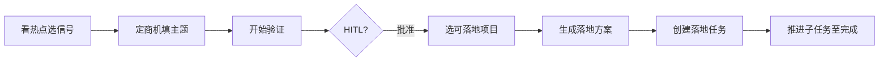

# LeadForge 产品需求文档（PRD）

> 版本：1.1 · 更新日期：2026-07-27 · Owner：LeadForge

## 1. 产品一句话

**LeadForge** 是给一人公司与小团队用的「看热点 → 定商机 → 选项目 → 去落地」商业智能体工作台。

## 2. 定位与差异化

| 维度 | LeadForge | 纯热点聚合 | SeekMoney 原版 |
|:---|:---|:---|:---|
| 输入 | 热搜 + 创投 + GitHub + 规则/AI | 热搜标题 | 社媒 UGC + 聚类 |
| 输出 | 可验证商机 + 工作流 + 项目 + 任务 | 资讯列表 | 痛点报告 |
| 落地 | 本机闭环 + HITL + 任务 CRUD | 无 | 导出 CSV |
| 约束 | OPC 两周可验证、红队门禁 | 无 | 优先级评分 |

## 3. 目标用户与场景

### 3.1 主用户：独立开发者 / OPC

- **场景 A**：晚上刷到行业焦虑信号 → 打开 LeadForge → 筛「医疗健康」→ 选一条商机 → 验证 → 选开源切片 → 建落地任务。
- **场景 B**：已有主题「牙科预约转化」→ 直接定商机开跑 → HITL 确认后生成方案与任务。

### 3.2 次用户：小团队增长

- 需要多通道信号对齐、可回放的运行记录、可审批的投放前红队。

## 4. 用户故事

1. 作为独立开发者，我希望从热搜中看到**可付费痛点**而不是吃瓜新闻，以便决定是否投入两周。
2. 作为操盘手，我希望点「开始验证」后立刻看到工作流进度，以便知道卡在哪一节点。
3. 作为交付负责人，我希望对落地任务做增删查改，以便日常推进而不是只读列表。
4. 作为审校人，我希望在真钱投放前强制 HITL，以便控制广告法与虚假宣传风险。

## 5. 信息架构（IA）

```
LEADFORGE
├── 01 看热点
│   ├── 多维页签（平台/商机/创投/痛点/AI重构）
│   └── AI 可落地商机
├── 02 定商机
│   ├── 主题与行业建议
│   ├── 场景包 / 流程模板
│   └── 开始验证 → 工作流进度
├── 03 选项目
│   ├── 可落地项目列表
│   └── 落地方案
├── 04 去落地
│   ├── 任务 CRUD + 搜索筛选
│   └── 子任务状态
└── 辅面板：工作流 / 审批 / 运行记录 / 同步日志
```

## 6. 核心流程

### 6.1 主路径（Happy Path）



### 6.2 验证工作流（默认模板）

主题输入 → 商机 → 模式 → 红队·模式 → HITL·模式 → 开发 → 部署 → 营销 → 红队·营销 → HITL·投放 → 飞轮

## 7. 功能优先级（MoSCoW）

| Must | Should | Could | Won't（本期） |
|:---|:---|:---|:---|
| 四步流水线 UI | AI 加深洞察 | Paperclip 同步 | TikHub 全量聚类 |
| SeekMoney 规则商机 | 定时同步日志 | n8n 编排扩展 | 多租户 |
| 验证工作流 + HITL | 项目组合推荐 | TrendRadar sidecar | 自动扣费投放 |
| 落地任务 CRUD | Theme Pack 扩容 | 免费模型目录 | 移动 App |

## 8. 成功指标（产品侧）

| 指标 | 定义 | 目标（内测） |
|:---|:---|:---|
| 验证启动成功率 | 点击开始验证到出现工作流 | ≥ 95% |
| 商机相关度主观分 | 用户认为「像商机不是新闻」 | ≥ 4/5 |
| 任务 CRUD 完成率 | 能在 UI 完成增删改查 | 100% |
| 密钥零泄漏 | 仓库无 .env / Token | 强制 |

## 9. 风险与对策

| 风险 | 对策 |
|:---|:---|
| 热搜被当商机 | SeekMoney 框架 + 吃瓜过滤 |
| 模型 Key 不可用 | 明确报错；演示模式仅 MOCK 标注 |
| 验证「没反应」 | 自动打开工作流 + 进度卡 |
| GPL 组件传染 | TrendRadar 仅 sidecar，不并入源码 |

## 10. 发布说明

- **交付形态**：私有 Git 仓库 + 本机 Windows 一键启动脚本
- **默认端口**：8080（控制台）
- **文档入口**：`docs/README.md`
