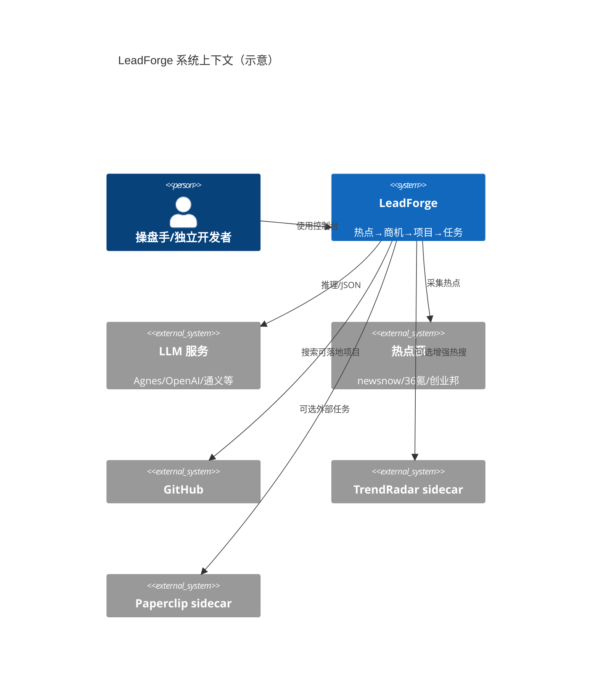

# LeadForge 架构设计文档

> 版本：1.1 · 更新日期：2026-07-27

## 1. 设计目标

1. **本机优先**：Windows 可本地启动；Docker 为增强全栈可选。
2. **可插拔垂直**：Theme Pack / 工作流模板 / 模型档位外置配置。
3. **门禁闭环**：红队 → HITL → 再进入开发/投放相关节点。
4. **许可隔离**：GPL 组件（TrendRadar）以 sidecar 运行，不进入主仓源码树逻辑合并。

## 2. 系统上下文



## 3. 逻辑分层

```
┌─────────────────────────────────────────────┐
│  Presentation：apps/api/static/index.html   │
│  四步流水线 + 辅面板（工作流/审批/记录）      │
├─────────────────────────────────────────────┤
│  API：FastAPI (apps/api/app/main.py)        │
│  /api/research/*  /api/runs/*  /api/landing-tasks/* │
├─────────────────────────────────────────────┤
│  Domain Services                              │
│  hotspot_lanes / seekmoney_clues / project_* │
│  landing_tasks / workflow / HITL / memory    │
├─────────────────────────────────────────────┤
│  Agents & Orchestration                       │
│  pipeline / node_runner / run_control / SSE  │
├─────────────────────────────────────────────┤
│  Adapters                                     │
│  LLMClient / newsnow / cyzone / github / RSS │
├─────────────────────────────────────────────┤
│  Persistence：data/*.json + SQLite 记忆       │
└─────────────────────────────────────────────┘
```

## 4. 核心模块

| 模块 | 路径 | 职责 |
|:---|:---|:---|
| 控制台 UI | `apps/api/static/index.html` | 四步流水线、模型配置、工作流可视化 |
| API 入口 | `apps/api/app/main.py` | HTTP/SSE、系统状态、研究与运行 API |
| 多维热点 | `tools/hotspot_lanes.py` | 五通道组装与行业过滤 |
| SeekMoney 线索 | `tools/seekmoney_clues.py` | 结构化商机（拒吃瓜） |
| 热点仓库 | `tools/hotspot_warehouse.py` | 缓存/预热/查询 |
| 同步调度 | `tools/sync_scheduler.py` | 定时增量抓取 |
| 项目推荐 | `tools/project_*.py` | 可落地过滤与方案 |
| 落地任务 | `tools/landing_tasks.py` | 本地 CRUD |
| 工作流 | `workflow_graph.py` / `node_runner.py` | 图执行与节点状态 |
| Agent 管线 | `agents/pipeline.py` | 商机/模式/开发/营销/飞轮 |
| 模型 | `llm.py` / `providers.py` | 多厂商路由 |
| Theme | `theme-packs/` | 垂直场景包 |
| 规则 | `rules/` | 广告法等 |

## 5. 运行时拓扑

### 5.1 本地模式（默认演示/开发）

```
Browser → FastAPI:8080 → LLM API（外网）
                      → data/（JSON/SQLite）
```

### 5.2 Docker 全栈

```
Browser → api:8080
            ├─ litellm:4000
            ├─ qdrant:6333
            ├─ redis
            ├─ n8n（可选）
            ├─ trendradar + mcp（sidecar）
            └─ paperclip（sidecar）
```

详见 `docker-compose.yml` 与 `docs/sidecars.md`。

## 6. 关键链路：验证工作流

1. `POST /api/runs/async` 创建 Trace。
2. 节点按模板边执行；状态写入 run graph。
3. `EventSource /api/runs/{id}/stream` 推送 step 事件。
4. HITL 节点暂停，待审批中心决策后继续。
5. 完成后可在运行记录回放。

## 7. 数据契约

- 运行时信封：`schemas/envelope.v1.json` + `app/envelope.py`（TraceID 贯穿）。
- 热点条目：统一 `title/url/snippet/provider/heat/meta`。
- 落地任务：`data/landing_tasks.json`（见详细设计）。

## 8. 安全架构

| 项 | 策略 |
|:---|:---|
| 密钥 | `.env` + 控制台写入；`.gitignore` 排除 `data/`、`.env` |
| 模型 | `MOCK_LLM` 显式开关；正式推荐接口拒绝 mock 源 |
| 许可 | GPL sidecar 进程隔离；主仓 MIT 友好组件为主 |
| API Token | `LEADFORGE_API_TOKEN`（部署时可启用） |

## 9. 扩展点

1. **Theme Pack**：新增 `theme-packs/<id>/pack.yaml`。
2. **工作流模板**：`config/workflow_templates/*.yaml`。
3. **模型档位**：`config/model_profiles/*.json`。
4. **Skills 白名单**：`config/skills.allowlist.yaml`。
5. **Agent 绑定**：`config/agent_bindings.yaml`。

## 10. 质量属性策略

| 属性 | 手段 |
|:---|:---|
| 可观测 | SSE 事件、同步日志、运行记录 |
| 可恢复 | 节点重跑、工作流暂停/继续 |
| 可测试 | 工具层纯函数（如 seekmoney/landing_tasks）可单测 |
