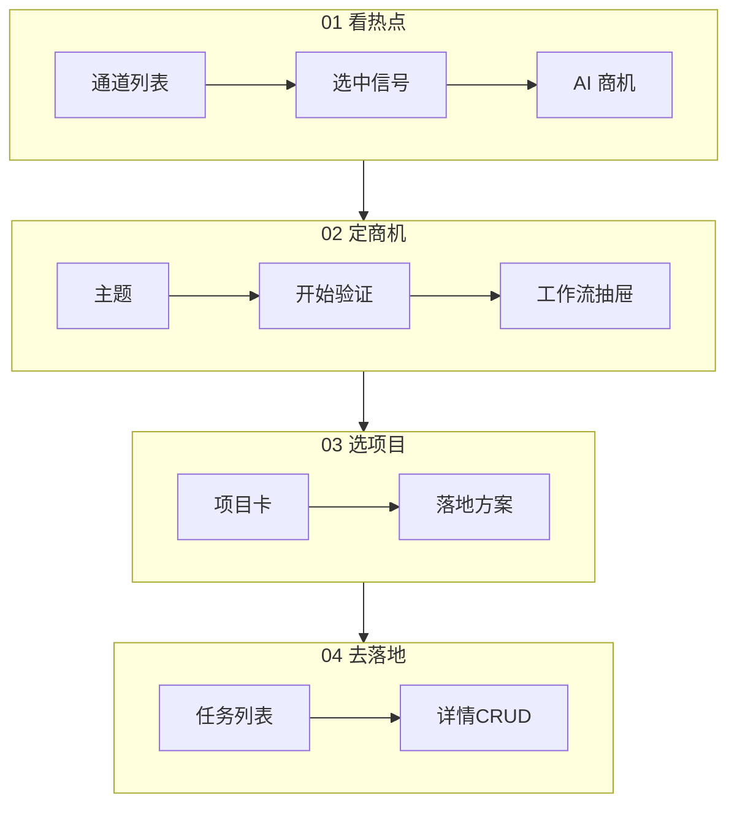

# LeadForge 原型说明文档

> 版本：1.1 · 更新日期：2026-07-27  
> 实现载体：`apps/api/static/index.html`（深色工作台，非独立 Figma 导出；本文即交互原型规格）

## 1. 设计原则

1. **一条流水线**：顶部 01–04 步进，当前步高亮。
2. **主区做事，辅区看过程**：工作流/审批/记录沉到抽屉，避免主区变仪表盘堆砌。
3. **品牌与信号色**：深底 `#10130c` + 信号绿 `#c6f000`；正文浅色，避免暗字暗底。
4. **开始即可见反馈**：关键动作必须打开对应面板或进度卡。

## 2. 全局框架

```
┌──────────────────────────────────────────────────────┐
│ TOPBAR：LEADFORGE · 审批 · 工作流 · 状态 Pills        │
├──────────────────────────────────────────────────────┤
│ PIPE：01看热点  02定商机  03选项目  04去落地            │
├────────────────────────────┬─────────────────────────┤
│ MAIN（当前 stage）          │ CONFIG RAIL 快捷/设置   │
├────────────────────────────┴─────────────────────────┤
│ AUX BAR：工作流 | 审批 | 运行记录 | 同步日志 | 节点    │
└──────────────────────────────────────────────────────┘
         ↑ 点击后上滑 AUX DRAWER（画布或检查器）
```

## 3. 页面原型

### 3.1 01 看热点

**布局**：左「多维热点」+ 右「AI 可落地商机」。

| 元件 | 说明 |
|:---|:---|
| 所属行业下拉 | 不限=全网；创投标准目录 |
| 通道页签 | 平台热搜 / 商机线索 / 创投 / 痛点 / AI重构 |
| 平台子页签 | 仅「平台热搜」显示；按名次 |
| 列表项 | 标题 + meta（行业/付费方/评分/成功率）+ 摘要；可点「查看详情 / 打开原文」 |
| 操作 | 同步热搜与创投、AI 加深、AI 提炼商机、生成落地项目 |

**商机线索卡片（SeekMoney）**

- 标题：`商机：{行业} · {痛点}`
- Meta：付费方、D/M/C/P、data_quality
- 正文：痛点 · 根因 · 两周 MVP

**AI 重构卡片**

- 标题：`AI重构：{场景} · {具体痛点}`（一痛点一条，不重复）
- Meta：项目名、成功概率、匹配依据
- 正文：痛点 · 为何此项目 · 组合更优 · 两周验证
- 详情弹层：上述字段 + 备选项目 + 打开 GitHub/搜索
### 3.2 02 定商机

**布局**：左「商机方向」+ 右「场景与规则」。

| 元件 | 说明 |
|:---|:---|
| 主题输入 | 必填才能开始验证 |
| 建议列表 `.rec-item` | 浅色标题 + 次级说明；选中描边 |
| 开始验证 | 主按钮；启动后按钮短暂「验证启动中…」 |
| 进度卡 | 进度条 + 看工作流/运行记录/审批/去选项目 |
| 场景包/行业/模板 | 影响推荐与工作流 |

**交互时序**

1. 用户点「开始验证」  
2. Toast/进度卡显示「正在启动」  
3. 自动 `openAux(canvas)`，底部「工作流」Tab 脉冲  
4. 节点状态刷新；待审批时引导「审批中心」

### 3.3 03 选项目

**布局**：筛选条 + 项目卡 + 落地方案区。

| 元件 | 说明 |
|:---|:---|
| 来源 Tab | 开源/创投等 |
| 项目卡 | 名称链接、可落地理由、操作（跑工作流/找组合） |
| 落地方案 | Markdown 预览，可交接去落地 |

### 3.4 04 去落地

**布局**：工具条 + 搜索筛选 + 任务列表 + 详情编辑。

| 操作 | UI |
|:---|:---|
| 增 | 「新建任务」表单 / 「从商机生成」 |
| 查 | 关键词 + 状态筛选 |
| 改 | 详情编辑标题/状态/方案；子任务下拉状态 |
| 删 | 列表/详情删除确认 |

**状态色**：todo 等待黄 · doing 信号绿 · done 成功绿 · blocked 危险红。

## 4. 辅面板原型

| Tab | 内容 |
|:---|:---|
| 工作流 | 节点画布 + 连线；点击节点进详情 |
| 审批中心 | HITL 任务列表与决策 |
| 运行记录 | Trace 列表，点击加载图 |
| 同步日志 | 定时抓取耗时/数量/错误 |
| 节点详情 | 输入/输出/日志/重跑 |

## 5. 关键状态机（验证）

```
idle → starting → running ⇄ paused(HITL)
                      ↓
                 finished | failed | stopped
```

UI 映射：`runStatusCard` 的 `running|paused|done|failed` 样式类。

## 6. 无障碍/可读性基线

| 元素 | 要求 |
|:---|:---|
| 正文 | `#eef2e4` 级浅色 |
| 次要说明 | `#b4c0a4` 及以上，禁止继承过暗 `.hint` 到可点卡片 |
| 主按钮 | `.btn.signal` 高对比 |
| 焦点 | 选中卡片可见描边 |

## 7. 线框索引（逻辑线框）

可用 Mermaid 代替静态图：



## 8. 与实现的对应

本文描述与当前 `index.html` 行为一致；若 UI 变更，请同步改本节「页面原型」与「关键状态机」。
